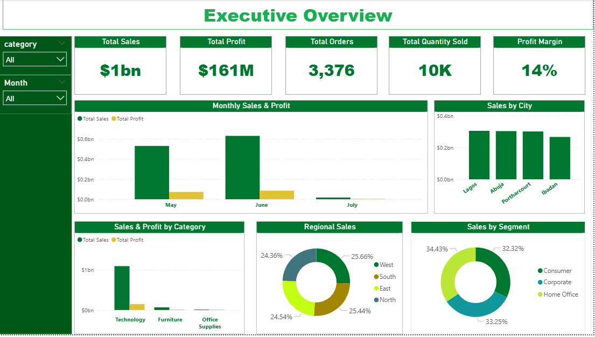
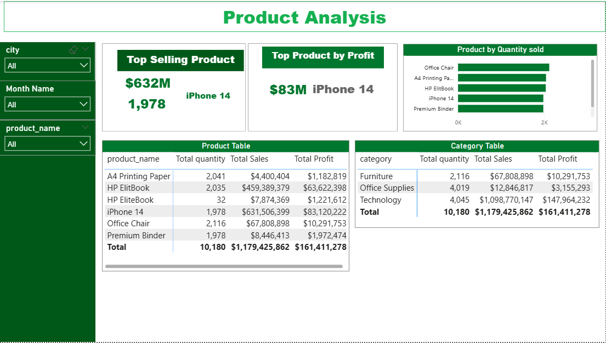

# 📊 Executive Sales Performance Dashboard

<p align="center">


</p>

---

## 📌 Project Overview

The **Executive Sales Performance Dashboard** is an end-to-end Business Intelligence project that demonstrates the complete analytics workflow—from data generation and storage to visualization and business insights.

This project simulates a real-world sales reporting solution where sales transactions are generated using Python, stored in a MySQL database, and visualized in Power BI through interactive dashboards.

The dashboard enables executives and decision-makers to monitor business performance, identify trends, evaluate profitability, and make data-driven decisions.

---

# 🚀 Project Workflow

```text
Sales Data Generator (Python)
            │
            ▼
      MySQL Database
            │
            ▼
      Power Query (ETL)
            │
            ▼
      Data Modeling
       (Star Schema)
            │
            ▼
      DAX Measures
            │
            ▼
     Power BI Dashboard
            │
            ▼
Business Insights & Recommendations
```

---

# 🎯 Business Problem

Businesses generate thousands of sales records every month. Without an effective reporting solution, management struggles to answer critical questions such as:

- Which products generate the most revenue?
- Which regions perform best?
- Which customers contribute the highest sales?
- Are profits increasing?
- How are sales changing over time?

This project answers these questions through an interactive executive dashboard.

---

# 🎯 Project Objectives

✔ Monitor overall business performance

✔ Analyze revenue and profitability

✔ Identify top-performing products

✔ Evaluate customer purchasing behavior

✔ Compare regional performance

✔ Monitor sales trends

✔ Support strategic decision-making

---

# 🗂 Dataset

The dataset contains simulated retail sales transactions.

| Column | Description |
|---------|-------------|
| Order ID | Unique order identifier |
| Order Date | Transaction date |
| Customer Name | Customer |
| Segment | Consumer, Corporate, Home Office |
| Region | Sales region |
| City | Customer city |
| Category | Product category |
| Sub Category | Product type |
| Product Name | Product sold |
| Quantity | Units sold |
| Sales | Revenue |
| Profit | Profit earned |

---

# 🛠 Technologies Used

| Tool | Purpose |
|------|----------|
| Python | Sales data generation |
| MySQL | Database |
| Power Query | Data cleaning |
| Power BI | Dashboard development |
| DAX | Business calculations |
| Git | Version control |
| GitHub | Portfolio hosting |

---

# 📊 Dashboard Pages

## 1️⃣ Executive Overview

Displays executive KPIs including:

- Total Sales
- Total Profit
- Total Orders
- Total Quantity
- Profit Margin
- Monthly Sales Trend
- Sales by Category
- Sales by Region
- Sales by Segment

---

## 2️⃣ Product Analysis

Provides insights into:

- Top-selling products
- Most profitable products
- Product quantities sold
- Product category performance

---

## 3️⃣ Customer Analysis

Analyzes:

- Top customers
- Customer profitability
- Customer segments
- Customer purchasing trends

---

## 4️⃣ Regional Analysis

Displays:

- Regional sales
- City performance
- Regional profitability
- Geographic distribution

---

# 📸 Dashboard Preview

## Executive Overview



---

## Product Analysis



---

## Customer Analysis


---

## Regional Analysis


> Replace these images with screenshots from your completed dashboard.

---

# 🧹 Data Cleaning

The data was transformed using **Power Query**.

Cleaning activities included:

- Removing duplicates
- Handling missing values
- Correcting data types
- Renaming columns
- Trimming text fields
- Creating dimension tables
- Validating numerical fields

---

# ⭐ Data
Sales Data
---

# 📐 DAX Measures

Examples include:

```DAX
Total Sales =
SUM(Sales[Sales])
```

```DAX
Total Profit =
SUM(Sales[Profit])
```

```DAX
Total Orders =
DISTINCTCOUNT(Sales[Order ID])
```

```DAX
Profit Margin =
DIVIDE([Total Profit],[Total Sales])
```

```DAX
Average Order Value =
DIVIDE([Total Sales],[Total Orders])
```

---

# 📈 Key Business Insights

Examples of insights generated from the dashboard:

- Technology products generated the highest revenue.
- Consumer customers contributed the largest share of sales.
- Abuja recorded the highest sales among all cities.
- Laptop sales accounted for the majority of revenue.
- Profit margins remained positive across all regions.
- A small number of customers generated a significant portion of revenue.
- Monthly sales trends highlighted periods of strong and weak performance.

---

# 💡 Business Recommendations

Based on the analysis:

- Increase inventory for high-performing products.
- Invest more marketing resources in profitable categories.
- Develop targeted campaigns for underperforming regions.
- Introduce loyalty programs for high-value customers.
- Review pricing strategies for products with low profit margins.

---

# 💼 Skills Demonstrated

### Business Intelligence

- KPI Development
- Executive Reporting
- Dashboard Design
- Business Storytelling

### Data Analytics

- Data Cleaning
- Data Transformation
- Data Modeling
- Star Schema Design
- DAX Calculations

### Technical Skills

- Power BI
- Power Query
- SQL
- Python
- MySQL
- Git
- GitHub

---

# 📂 Repository Structure

```text
Executive-Sales-Dashboard/
│
├── Dashboard/
│   └── Executive_Sales_Dashboard.pbix
│
├── Data/
│   ├── Raw/
│   └── Cleaned/
│
├── Python/
│   ├── generate_sales.py
│   └── upload_to_mysql.py
│
├── SQL/
│   └── create_database.sql
│
├── Documentation/
│
├── Images/
│
├── README.md
└── LICENSE
```

---

# 🎓 What I Learned

Through this project, I strengthened my ability to:

- Build end-to-end Business Intelligence solutions.
- Design scalable data models using a Star Schema.
- Write reusable DAX measures for KPI reporting.
- Connect Power BI to relational databases.
- Apply ETL techniques using Power Query.
- Create executive dashboards focused on business value.
- Present technical findings through clear data storytelling.

---

# 🔮 Future Improvements

- Deploy to Power BI Service
- Implement Row-Level Security (RLS)
- Enable scheduled refresh
- Add forecasting
- Connect to cloud databases (Azure SQL/PostgreSQL)
- Add drill-through pages
- Build a mobile-friendly report

---

# 👨‍💻 About Me

**Temu Osirim**

Data Analyst | Power BI Developer | Python Developer

### Technical Skills

- Power BI
- SQL
- Python
- Excel
- Power Query
- DAX
- Data Visualization
- Business Intelligence

---

⭐ If you found this project interesting, feel free to star the repository!
